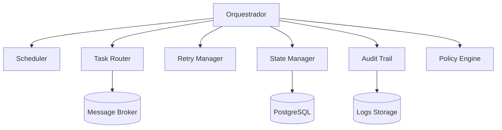

# C4 - Componentes

Detalhamento interno do orquestrador.

## Componentes
- **Scheduler:** agenda jobs
- **Task Router:** distribui tarefas para workers
- **Retry Manager:** aplica backoff e retentativas
- **State Manager:** controla estados
- **Audit Trail:** garante rastreabilidade
- **Policy Engine:** regras e limites operacionais
