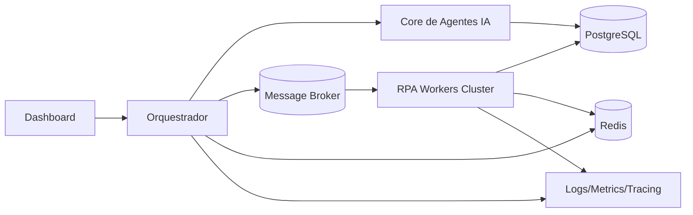

# C4 - Containers

Diagrama de containers principais.

```mermaid
flowchart LR
    UI[Dashboard] --> Orchestrator[Orquestrador]
    Orchestrator --> AgentCore[Core de Agentes IA]
    Orchestrator --> Broker[(Message Broker)]

    Broker --> Workers[RPA Workers Cluster]

    AgentCore --> DB[(PostgreSQL)]
    Workers --> DB

    Orchestrator --> Cache[(Redis)]
    Workers --> Cache

    Orchestrator --> Obs[Logs/Metrics/Tracing]
    Workers --> Obs
```

## Notas
- O broker desacopla decisão da execução
- Workers podem escalar horizontalmente
