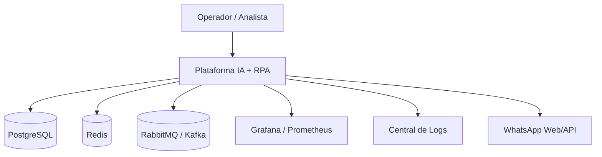

# C4 - Contexto

Diagrama de contexto do sistema.

```mermaid
flowchart TB
    User[Operador / Analista] --> Platform[Plataforma IA + RPA]

    Platform --> DB[(PostgreSQL)]
    Platform --> Cache[(Redis)]
    Platform --> Broker[(RabbitMQ / Kafka)]
    Platform --> Monitoring[Grafana / Prometheus]
    Platform --> Logs[Central de Logs]

    Platform --> WhatsApp[WhatsApp Web/API]
```

## Descrição
A plataforma centraliza decisão e execução automatizada, mantendo auditoria e rastreabilidade.
